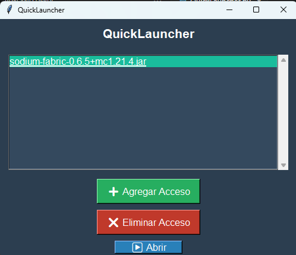

# 🚀 QuickLauncher

QuickLauncher es una aplicación sencilla pero poderosa que permite acceder rápidamente a programas y archivos desde una interfaz gráfica amigable.

## 📌 Características
✅ Interfaz moderna y fácil de usar 🎨

✅ Permite agregar accesos rápidos a programas y archivos 📂

✅ Guarda los accesos entre sesiones 🔄

✅ Soporta eliminación y ejecución rápida con un solo clic ⚡

## 🛠 Requisitos
🔹 Python 3.x
🔹 Tkinter (incluido por defecto en Python)

## 📥 Instalación
1. Clona este repositorio o descarga el archivo `quicklauncher.py`:
   ```bash
   git clone https://github.com/tu-usuario/QuickLauncher.git
   cd QuickLauncher
   ```
2. Ejecuta el script con Python:
   ```bash
   python quicklauncher.py
   ```

## 🎮 Uso
- Presiona `Agregar Acceso` para seleccionar un archivo o programa.
- Presiona `Abrir` para ejecutar el acceso seleccionado.
- Presiona `Eliminar Acceso` para remover un acceso de la lista.

## 🖼 Captura de Pantalla


## ⚖️ Licencia
Este proyecto está bajo la Licencia MIT. ¡Siéntete libre de contribuir! 😊
